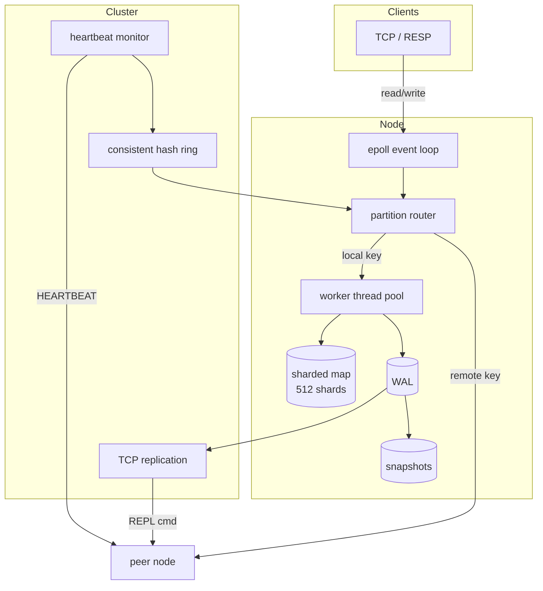

# Distributed Storage Engine

C++17 in-memory key-value store with epoll networking, sharded concurrency, WAL durability, and a small distributed cluster layer.

## Why I Built This

I started this because I did not actually understand how Redis keeps thousands of TCP connections alive without melting a CPU, or how you get read throughput to scale when every thread hits the same hash table. I wanted to build the smallest version of that stack myself: one thread doing socket I/O with epoll, a pool of workers handling commands, per-shard locks instead of one global mutex, and then the distributed pieces on top (partitioning keys across nodes, replicating writes, detecting failures). Two weeks of evenings in March/April 2026. Not production ready, but every layer is real code I can explain in an interview.

## Benchmarks

8 cores, Release (`-O3 -march=native`), Linux/Docker, `gcc 13`:

| Test | Result |
|------|--------|
| Mixed GET/SET throughput | ~5M ops/sec |
| Sharded reads vs single mutex map | 4x to 7x |
| Concurrent TCP clients | 10,000 |

```bash
./build/bench-throughput
./build/bench-read-compare
./build/bench-clients 10000
```

## Architecture



**Networking.** One thread runs `epoll_wait` on all client sockets. Edge-triggered, non-blocking I/O. Parsed commands go to a worker queue; responses are flushed back on the same connection. Tested up to 12k concurrent connections.

**Storage.** 512 shards, each with its own `shared_mutex`. Reads take a shared lock, writes take exclusive. This is the main reason reads beat a single `std::mutex` map under contention.

**Durability.** Writes append a binary record to the WAL. On restart the WAL is replayed. A background thread snapshots the full keyspace every 60 seconds.

**Partitioning.** Keys map to nodes through a consistent hash ring (128 vnodes per node). Any node can accept traffic; if the key belongs elsewhere, the router forwards the command over TCP to the owner.

**Replication.** The owner appends to WAL, then ships a `REPL` frame to the next replicas on the ring. Followers apply the record to their local store and WAL.

**Failover.** Peers ping each other with `HEARTBEAT`. If a node goes quiet for 3 seconds (after a 15s startup grace), recovery marks it down and remaps its vnodes to the next live successor.

## Commands

```
PING
GET key
SET key value [ttl_ms]
DEL key
EXISTS key
INCR key
DECR key
INFO
```

Cluster-internal: `REPL`, `HEARTBEAT`.

## Build

Linux only (needs epoll).

```bash
mkdir build && cd build
cmake .. -DCMAKE_BUILD_TYPE=Release
cmake --build . -j$(nproc)
```

Docker:

```bash
docker build -t dse .
docker run --rm --cpus=8 dse bash scripts/benchmark.sh
```

## Run

Single node:

```bash
./build/dse-server --port 6379 --threads 8 --data ./data
```

3-node cluster:

```bash
bash scripts/run_cluster.sh
```

Manual peer config:

```bash
./build/dse-server --port 6379 --node node-1 --data ./data/node1 \
  --peers node-2:127.0.0.1:6380,node-3:127.0.0.1:6381
```

Verify routing + replication path:

```bash
bash scripts/test_cluster.sh
```

## Project Layout

```
include/dse/
  net/       epoll loop, tcp server
  engine/    sharded map, command executor
  cluster/   hash ring, router, replication, recovery
src/         implementations
bench/       throughput, read comparison, client load
scripts/     benchmark, cluster, smoke test
```

## Next Steps

- Quorum commit before acking writes
- Incremental snapshot transfer to new replicas
- LRU eviction when memory is capped

## Requirements

- Linux with epoll
- g++ 11+ or clang 14+
- cmake 3.16+
